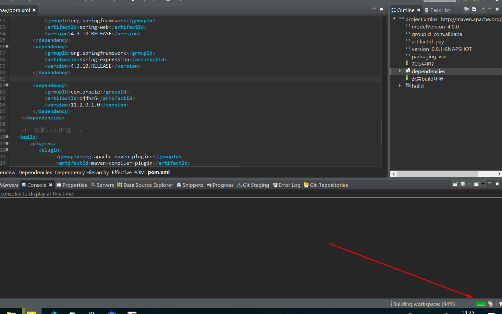

# 72-Java-springMVC如何使用全局异常处理?.md

```
1.配置依赖：编辑pom.xml文件
springMVC的依赖   日志包的依赖   校验包的依赖 注意不要少包：aop context tx aspect expression  core web webMVC

2.编写Controller：商品管理模块的控制器


3.定义商品实体类，并在ProductController中定义修改商品信息的方法

public String updateProduct(Product product)
{
	if(product.getId()==100)//把这种情况当做这个商品已经不存在了
	{
		throw new CustomException("商品已经不存在了");
	}else
	{
		//修改商品信息
		System.out.println("修改商品信息");
		return "";
	}
}

4.自定义异常类型

5.定义统一的异常处理器ExceptionResolver
注意给类加注解：@ControllerAdvice  
给方法加注解：@ExceptionHandler

修改：springMVC.xml文件，把全包扫描的包名改成：net.neuedu.demo,这样handler包也会扫描到

6.配置并测试
先请求：http://localhost:8080/pay/product/udpateProduct.do?productId=10 正常
再请求：http://localhost:8080/pay/product/udpateProduct.do?productId=100 会抛出异常并处理异常

```
1. 配置pom.xml 导包

```
<project xmlns="http://maven.apache.org/POM/4.0.0" xmlns:xsi="http://www.w3.org/2001/XMLSchema-instance" xsi:schemaLocation="http://maven.apache.org/POM/4.0.0 http://maven.apache.org/xsd/maven-4.0.0.xsd">
  <modelVersion>4.0.0</modelVersion>
  <groupId>com.alibaba</groupId>
  <artifactId>pay</artifactId>
  <version>0.0.1-SNAPSHOT</version>
  <packaging>war</packaging>
  
  <!-- 怎么导包？ -->
	<dependencies>
		<!-- https://mvnrepository.com/artifact/javax.servlet/javax.servlet-api -->
		<dependency>
			<groupId>javax.servlet</groupId>
			<artifactId>javax.servlet-api</artifactId>
			<version>3.1.0</version>
			<scope>provided</scope>
		</dependency>
		<!-- <dependency> <groupId>com.oracle</groupId> <artifactId>ojdbc6</artifactId> 
			<version>11.1.0.7.0</version> </dependency> -->
		<!-- https://mvnrepository.com/artifact/org.codehaus.jackson/jackson-core-asl -->
		<!-- https://mvnrepository.com/artifact/com.fasterxml.jackson.core/jackson-annotations -->
		<dependency>
			<groupId>com.fasterxml.jackson.core</groupId>
			<artifactId>jackson-annotations</artifactId>
			<version>2.9.8</version>
		</dependency>
		<!-- https://mvnrepository.com/artifact/com.fasterxml.jackson.core/jackson-databind -->
		<dependency>
			<groupId>com.fasterxml.jackson.core</groupId>
			<artifactId>jackson-databind</artifactId>
			<version>2.9.8</version>
		</dependency>
		<!-- https://mvnrepository.com/artifact/com.fasterxml.jackson.core/jackson-core -->
		<dependency>
			<groupId>com.fasterxml.jackson.core</groupId>
			<artifactId>jackson-core</artifactId>
			<version>2.9.8</version>
		</dependency>


		<dependency>
			<groupId>jstl</groupId>
			<artifactId>jstl</artifactId>
			<version>1.2</version>
		</dependency>
		<dependency>
			<groupId>org.springframework</groupId>
			<artifactId>spring-beans</artifactId>
			<version>4.3.10.RELEASE</version>
		</dependency>
		<dependency>
			<groupId>org.springframework</groupId>
			<artifactId>spring-context</artifactId>
			<version>4.3.10.RELEASE</version>
		</dependency>
		<dependency>
			<groupId>org.springframework</groupId>
			<artifactId>spring-aop</artifactId>
			<version>4.3.10.RELEASE</version>
		</dependency>
		<dependency>
			<groupId>org.springframework</groupId>
			<artifactId>spring-aspects</artifactId>
			<version>4.3.10.RELEASE</version>
		</dependency>
		<dependency>
			<groupId>org.springframework</groupId>
			<artifactId>spring-tx</artifactId>
			<version>4.3.10.RELEASE</version>
		</dependency>

		<dependency>
			<groupId>commons-io</groupId>
			<artifactId>commons-io</artifactId>
			<version>1.3.2</version>
		</dependency>
		<dependency>
			<groupId>commons-fileupload</groupId>
			<artifactId>commons-fileupload</artifactId>
			<version>1.3.1</version>
		</dependency>
		<dependency>
			<groupId>org.springframework</groupId>
			<artifactId>spring-jdbc</artifactId>
			<version>4.3.10.RELEASE</version>
		</dependency>
		<dependency>
			<groupId>org.springframework</groupId>
			<artifactId>spring-webmvc</artifactId>
			<version>4.3.10.RELEASE</version>
		</dependency>
		<dependency>
			<groupId>org.springframework</groupId>
			<artifactId>spring-web</artifactId>
			<version>4.3.10.RELEASE</version>
		</dependency>
		<dependency>
			<groupId>org.springframework</groupId>
			<artifactId>spring-expression</artifactId>
			<version>4.3.10.RELEASE</version>
		</dependency>
		
		<dependency>
			<groupId>com.oracle</groupId>
			<artifactId>ojdbc6</artifactId>
			<version>11.2.0.1.0</version>
		</dependency>
	</dependencies>
	
	<!-- 配置build环境 -->
   <build>
       <plugins>
          <plugin>
				<groupId>org.apache.maven.plugins</groupId>
				<artifactId>maven-compiler-plugin</artifactId>
				<version>3.2</version>
				<configuration>
					<source>1.7</source>
					<target>1.7</target>
					<encoding>utf-8</encoding>
				</configuration>
			</plugin>
			<plugin>
				<groupId>org.apache.tomcat.maven</groupId>
				<artifactId>tomcat7-maven-plugin</artifactId>
				<version>2.2</version>
				<configuration>
					<port>8080</port>
					<path>/pay</path>
				</configuration>
			</plugin>      
       </plugins>
  </build> 
</project>
```
保存后会自动下载所需依赖包，如图所示



2. 新建一个ProductController类和Product类

```
package net.tencent.demo.domain;
/**
 * 商品实体类
* <p>Title: Product</p>  
* <p>Description: </p>  
* @author xianxian 
* @date 2019年6月28日
 */
public class Product {
	private Integer productId;
	private String productName;
	public Integer getProductId() {
		return productId;
	}
	public void setProductId(Integer productId) {
		this.productId = productId;
	}
	public String getProductName() {
		return productName;
	}
	public void setProductName(String productName) {
		this.productName = productName;
	}
	@Override
	public String toString() {
		return "Product [productId=" + productId + ", productName="
				+ productName + "]";
	}
	public Product(Integer productId, String productName) {
		super();
		this.productId = productId;
		this.productName = productName;
	}
	public Product() {
		super();
	}
}
```

```
package net.tencent.demo.controller;

import org.springframework.stereotype.Controller;
import org.springframework.web.bind.annotation.RequestMapping;

import net.tencent.demo.domain.Product;

/**
 * 商品管理模块的控制器
* <p>Title: ProductController</p>  
* <p>Description: </p>  
* @author xianxian 
* @date 2019年6月28日
 */
@Controller
@RequestMapping("product")
public class ProductController {

	/**
	 * 处理更新商品信息的请求的方法
	 * @param product
	 * @return
	 * @throws CustomException 
	 */
	@RequestMapping("updateProduct.do")
	public String updateProduct(Product product) throws CustomException
	{
		if(product.getProductId()==100)//把这种情况当做这个商品已经不存在了
		{
			throw new CustomException("商品已经不存在了");
		}else
		{
			//修改商品信息
			System.out.println("修改商品信息");
			return "index";
		}
	}
}
```

3. 因没有自定义异常CustomException而导致ProductController类报错所以需要创建这个自定义异常类,之后在ProductController类中再次导入这个包

```
package net.tencent.demo.exception;
/**
 * 自定义异常
* <p>Title: CustomException</p>  
* <p>Description: </p>  
* @author xianxian 
* @date 2019年6月28日
 */
public class CustomException extends Exception{
	
	private String message;
	
	public CustomException(String message)
	{
		this.message=message;
	}

	public String getMessage() {
		return message;
	}

	public void setMessage(String message) {
		this.message = message;
	}
}
```
4. 配置异常处理器，新建类CustomExceptionResolver实现接口HandlerExceptionResolver

```
package net.tencent.demo.handler;

import javax.servlet.http.HttpServletRequest;
import javax.servlet.http.HttpServletResponse;

import org.springframework.web.servlet.HandlerExceptionResolver;
import org.springframework.web.servlet.ModelAndView;

import net.tencent.demo.exception.CustomException;
/**
 * 这个不是异常类型， 是全系统统一进行异常处理的异常处理器
* <p>Title: CustomExceptionResolver</p>  
* <p>Description: </p>  
* @author xianxian 
* @date 2019年6月28日
 */
//@ControllerAdvice
public class CustomExceptionResolver implements HandlerExceptionResolver {
	//@ExceptionHandler
	@Override
	public ModelAndView resolveException(HttpServletRequest request, HttpServletResponse response, Object handler,
			Exception ex) {
		/**
		 * 对要处理的异常对象ex进行判断，看是哪种类型，针对类型做出不同的处理
		 * ProductAlreayDeletedException
		 */
		Exception e=null;
		if(ex instanceof CustomException)
		{
			e=(CustomException)ex;
		}else
		{
			e=new CustomException("未知错误");
		}
		ModelAndView mav=new ModelAndView();
		mav.setViewName("error");
		mav.addObject("message", e.getMessage());
		return mav;
	}
}
```

5. 需要将这个异常配置下，在src/main/webapp/WEB-INF目录下配置springmvc-servlet.xml

```
<?xml version="1.0" encoding="UTF-8"?>

<beans xmlns="http://www.springframework.org/schema/beans"
	xmlns:xsi="http://www.w3.org/2001/XMLSchema-instance" xmlns:context="http://www.springframework.org/schema/context"
	xmlns:mvc="http://www.springframework.org/schema/mvc" xmlns:aop="http://www.springframework.org/schema/aop"
	xsi:schemaLocation="http://www.springframework.org/schema/beans
           http://www.springframework.org/schema/beans/spring-beans-2.5.xsd
           http://www.springframework.org/schema/mvc http://www.springframework.org/schema/mvc/spring-mvc.xsd
           http://www.springframework.org/schema/context http://www.springframework.org/schema/context/spring-context-2.5.xsd
           http://www.springframework.org/schema/aop http://www.springframework.org/schema/aop/spring-aop-2.5.xsd">

	<!-- <bean id="handlerExceptionResolver" class="net.neuedu.demo.handler.CustomExceptionResolver"></bean> -->

	<bean
		class="org.springframework.web.servlet.view.InternalResourceViewResolver">
		<property name="prefix" value="/"></property>
		<property name="suffix" value=".jsp"></property>  <!-- /WEB-INF/index.jsp -->
	</bean>

	<mvc:annotation-driven></mvc:annotation-driven>

	<!-- 定义校验器bean -->
	<!-- <bean id="validator"
		class="org.springframework.validation.beanvalidation.LocalValidatorFactoryBean">
		<property name="providerClass" value="org.hibernate.validator.HibernateValidator"></property>
		<property name="validationMessageSource" ref="messageSource"></property>
	</bean> -->

<!-- 定义校验出错的信息提示文件 -->
	<!-- <bean id="messageSource"
		class="org.springframework.context.support.ReloadableResourceBundleMessageSource">
		<property name="basenames">
			<list>
				<value>classpath:customerValidationMessages</value>
			</list>
		</property>
		<property name="fileEncodings" value="utf-8"></property>
	</bean> -->


	<!-- <bean id="conversionService"
		class="org.springframework.format.support.FormattingConversionServiceFactoryBean">
		<property name="converters">
			<list>
				<bean class="net.neuedu.demo.converter.CustomerDateConverter"></bean>
			</list>
		</property>

	</bean> -->
	
	<bean class="org.springframework.web.servlet.mvc.method.annotation.RequestMappingHandlerAdapter">
		<property name="messageConverters">
			<list>
			
			<bean class="org.springframework.http.converter.json.MappingJackson2HttpMessageConverter"/>
			</list>
		</property>
	</bean>

	<context:component-scan base-package="net.tencent.demo"></context:component-scan>
</beans>
```
6. 新建error.jsp

```
<%@ page language="java" contentType="text/html; charset=UTF-8"
    pageEncoding="UTF-8"%>
<!DOCTYPE html>
<html>
<head>
<meta charset="UTF-8">
<title>Insert title here</title>
</head>
<body>
出错了：${message}
</body>
</html>
```