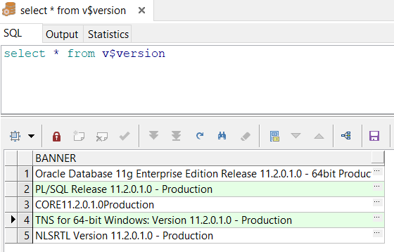
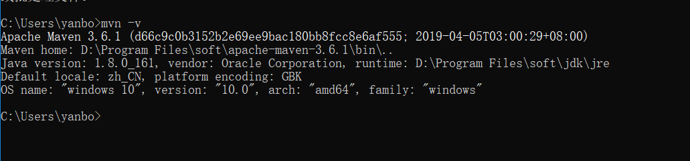
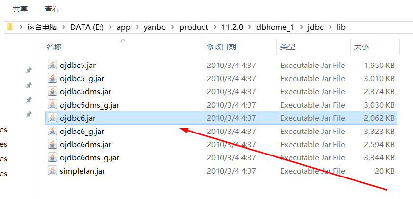
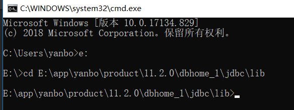
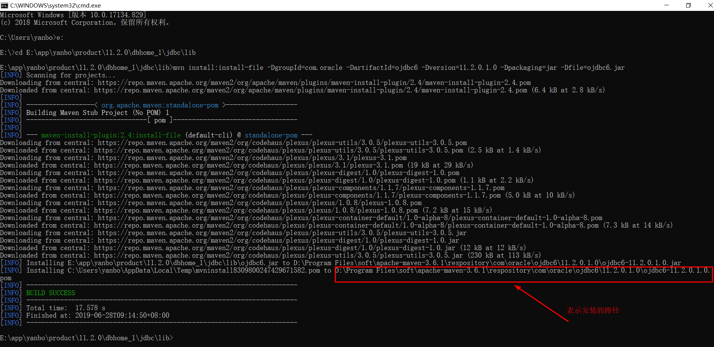
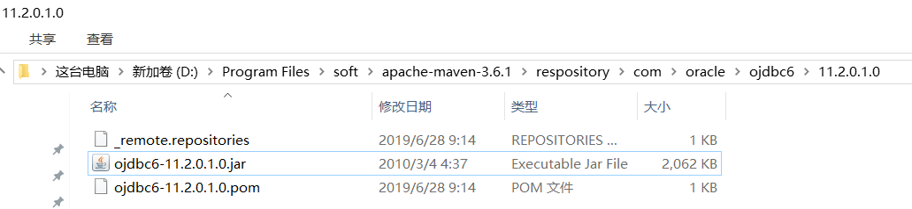
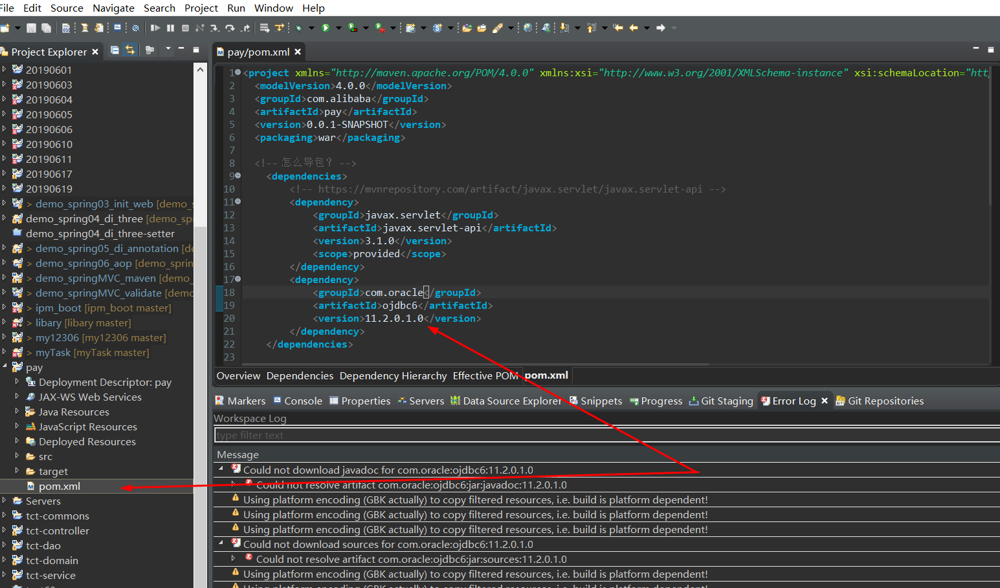

# 69-Java如何设置Maven仓库中没有的坐标_oracle驱动包.md
fdsfdsfd
注意：Oracle驱动没有Maven构建，需要自己创建构建;

1. 查询Oracle的版本 select * from v$version; 或参考博客 [Oracle-查看版本号](https://www.jianshu.com/p/380dca06c1cb)



|      |   BANNER |
| ---- | ---- |
|   1  | Oracle Database 11g Enterprise Edition Release 11.2.0.1.0 - 64bit Production     |
|   2  | PL/SQL Release 11.2.0.1.0 - Production     |
|   3  | CORE	11.2.0.1.0	Production     |
|   4  | TNS for 64-bit Windows: Version 11.2.0.1.0 - Production      |
|   5  | NLSRTL Version 11.2.0.1.0 - Production     |

2. 确定自已已经安装好Maven的环境，若未安装好参考博客 [Java-Window10-Maven环境搭建](https://www.jianshu.com/p/4d20aa036db4),cmd 中输入 mvn -v 进行验证,如图所示表明环境欧克。



3. mvn install : install-file-DgroupId=com.oracle  -DartifactId=ojdbc14-Dversion=10.2.0.5. 0 -Dpackaging=jar -Dfile=本地路径\ojdbc12.jar可以来到jar所在目录下执行这段按照命令：mvn install:install-file -DgroupId=com.oracle -DartifactId=ojdbc6 -Dversion=11.2.0.1.0 -Dpackaging=jar -Dfile=ojdbc6.jar

+ 首先确定是否有 **ojdbc12.jar** 包，一般都在Oracle的安装目录，例我的目录在 E:\app\yanbo\product\11.2.0\dbhome_1\jdbc\lib\ojdbc6.jar



所以对应执行这段命令我应该先进入这个路径下

```
E:

cd E:\app\yanbo\product\11.2.0\dbhome_1\jdbc\lib
```



将上述命令的版本号更改为自己的版本号所以对应的命令应该为：

```
mvn install:install-file -DgroupId=com.oracle -DartifactId=ojdbc6 -Dversion=11.2.0.1.0 -Dpackaging=jar -Dfile=ojdbc6.jar
```



如上图所示的安装路径，确定是否是安装在对应的路径

```
D:\Program Files\soft\apache-maven-3.6.1\respository\com\oracle\ojdbc6\11.2.0.1.0\ojdbc6-11.2.0.1.0.jar
```



4. 设置好坐标之后在工程里引用这个坐标



```
<project xmlns="http://maven.apache.org/POM/4.0.0" xmlns:xsi="http://www.w3.org/2001/XMLSchema-instance" xsi:schemaLocation="http://maven.apache.org/POM/4.0.0 http://maven.apache.org/xsd/maven-4.0.0.xsd">
  <modelVersion>4.0.0</modelVersion>
  <groupId>com.alibaba</groupId>
  <artifactId>pay</artifactId>
  <version>0.0.1-SNAPSHOT</version>
  <packaging>war</packaging>
  
  <!-- 怎么导包？ -->
	<dependencies>
		<!-- https://mvnrepository.com/artifact/javax.servlet/javax.servlet-api -->
		<dependency>
			<groupId>javax.servlet</groupId>
			<artifactId>javax.servlet-api</artifactId>
			<version>3.1.0</version>
			<scope>provided</scope>
		</dependency>
		<dependency>
			<groupId>com.oracle</groupId>
			<artifactId>ojdbc6</artifactId>
			<version>11.2.0.1.0</version>
		</dependency>
	</dependencies>
	
	<!-- 配置build环境 -->
   <build>
       <plugins>
          <plugin>
				<groupId>org.apache.maven.plugins</groupId>
				<artifactId>maven-compiler-plugin</artifactId>
				<version>3.2</version>
				<configuration>
					<source>1.7</source>
					<target>1.7</target>
					<encoding>utf-8</encoding>
				</configuration>
			</plugin>
			<plugin>
				<groupId>org.apache.tomcat.maven</groupId>
				<artifactId>tomcat7-maven-plugin</artifactId>
				<version>2.2</version>
				<configuration>
					<port>8080</port>
					<path>/pay</path>
				</configuration>
			</plugin>      
       </plugins>
  </build> 
</project>
```

**以就就是我关于 Java如何设置Maven仓库中没有的坐标_oracle驱动包  知识点的整理与总结的全部内容 [另附源码](https://github.com/javaobjects/pay)**

==================================================================
#### 分割线
==================================================================

**博主为咯学编程：父母不同意学编程，现已断绝关系;恋人不同意学编程，现已分手;亲戚不同意学编程，现已断绝来往;老板不同意学编程,现已失业三十年。。。。。。如果此博文有帮到你欢迎打赏，金额不限。。。**

 
